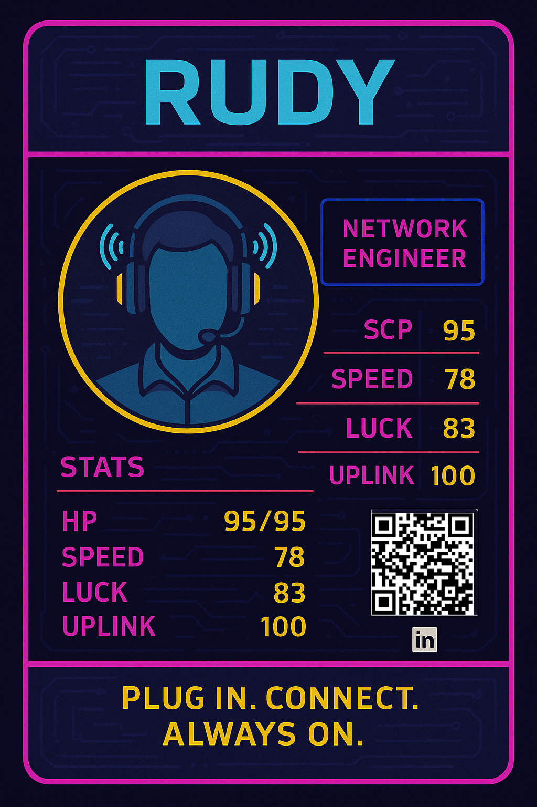

  

<h2 align="center">🛰️ Network Dev • 🧠 Code Hacker • 🛠️ Cyberpunk Engineer</h2>

  

---

## 🦾 System Identity

> Side Quest: survive the network, survive the deadline.

**Buffs Applied:**
- ☕ **3x Kopi Tubruk** (Stamina +10)
- 🔧 **7x StackOverflow** (Wisdom +50)
- 🔄 **CTRL+ALT+Z** (Undo Reality)
- ⌛ **Latency Immunity** (Experimental)

**Passives:**
- Serial Monitor Instinct
- Can smell burned PCB from 30 meters

---

## 🔥 Role & Skills

🪪 **Alias:** `rudy`  
🧭 **Class:** Informatics Engineer  
🛰️ **Specialty:** Systems that shouldn’t work… working anyway

🧠 **Skill Tree:**
- Python / PyQt5 / SQLite
- Arduino / ESP8266
- MikroTik / Ruijie
- Debugging at 2 AM with coffee and regret

---

## 🚀 Mission

> “Integrate or die trying.”

Everything must talk:
- Apps
- Networks
- Sensors
- Databases

If they don’t…  
I make them.

---

## 📡 Active Zone

🌏 Based in Indonesia  
📡 Currently patching reality  
🎯 Grinding Final Capstone

---

## ☣️ Tech Stack

  
  
  
  
  
  
  

---

## 🧠 Life Philosophy

> If it breaks, cool. Now I get to fix it.

---

## 🔗 Neural Link

  

---

  <code>"Hack. Patch. Deploy. Repeat."</code>

  

